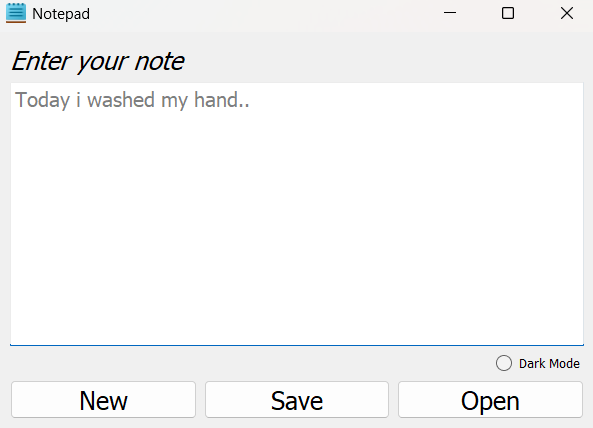
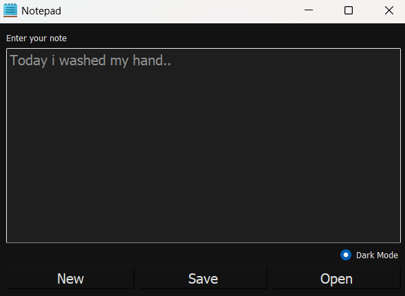

# PyQt5 Notepad Application

A simple PyQt5-based Notepad application.  
Allows users to take notes, open text files, save notes, and toggle between dark and light modes.

---

## Features

- Create new notes
- Open text files (.txt)
- Save notes as text files (.txt)
- Toggle between dark and light themes

---

## Requirements

- Python 3.x
- PyQt5

## App View



```bash
pip install PyQt5


